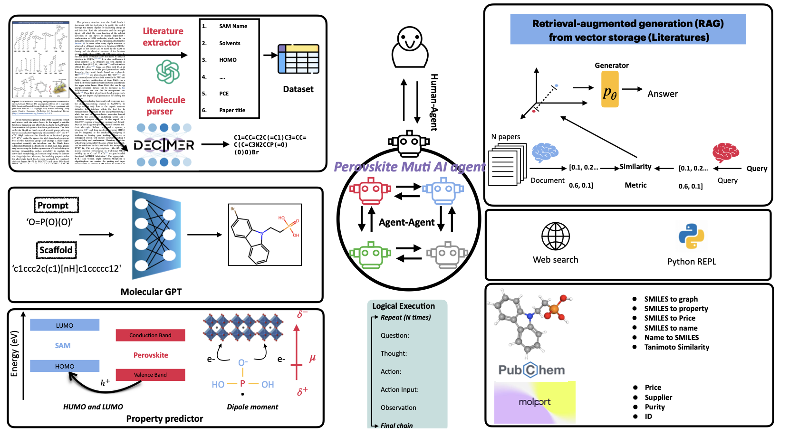

# Perovskite MultiAI Agent (Not released)
These code are written during my undergraduate. So, my code skills might not be clean and formal as now. Appologize for that.

## Schematic of Perovskite Muti-AI Agent

## Functionality of this system
Please note that since the Unimol (mol predictor) and Synthesis advisor tool has large model weight. So, you can directlt fork the repository from [Unimol](https://github.com/deepmodeling/Uni-Mol) and [RetroExplainer](https://github.com/wangyu-sd/RetroExplainer). This repo is **pre-released** since . I will keep updating it until manuscript submission.

- **Literature Data Extractor**

  Helps pull useful information from research papers, such as material properties or experimental details, to support molecule evaluation.

- **Retrieval-Augmented Generation (RAG)**

  Improves molecule suggestions by referencing external sources, making the model’s output more informed and grounded.

- **SAMGPT**

  A molecule generator that can take structure constraints and desired properties into account. Useful for designing molecules like SAMs (self-assembled monolayers).

- **UniMol**

  A model used to predict properties of molecules, helping to screen and evaluate generated candidates before further steps.

- **Supplier Search Tool (via MolPort API)**

  Finds available molecules from commercial suppliers, along with their prices and other purchasing information.

- **Molecule Utilities**

  Offers tools for drawing molecules and converting between IUPAC names and SMILES strings:

  IUPAC $\rightleftharpoons$ SMILES

- **Retrosynthesis Planner**

  Suggests possible synthetic routes for the generated molecules, to help check how they might be made in practice.

## How to use Perovskite Multi-AI Agent
The AI_agents jupyter notebook provides some examples of invoking the agent. You can change the API in the notebook.

## PSC dataset collected from literatures
The all_PSC_dataset contains parameters extracted from approximately 319 papers (ACS, Springer, Elsevier, Weily, etc.)
